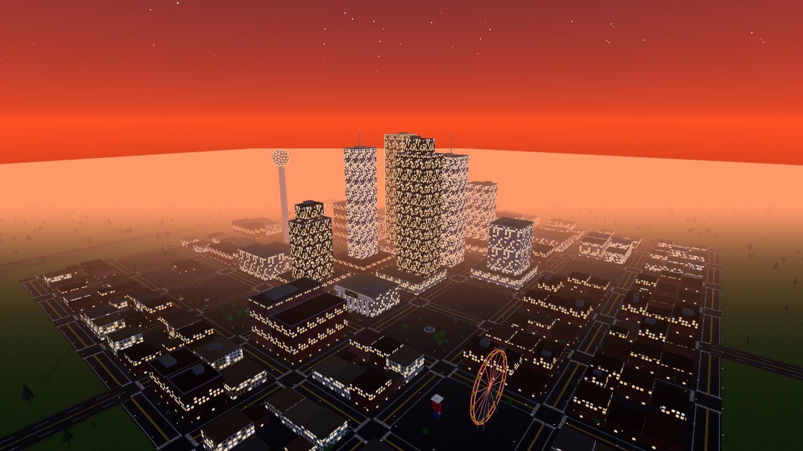

# Grand Theft: Southern Heat



A GTA V-style open-world game that runs in the browser. You drive, fly and fight your way across **Dallas**, **New Orleans** and **Atlanta**, which are joined by interstates. It's built with Three.js and has no build step. All of the geometry, textures and audio are procedural, so there are no asset files.

## Run it

Browsers block ES modules loaded from `file://`, so you have to serve the folder over HTTP:

```bash
cd game
python3 -m http.server 8000
# open http://localhost:8000
```

Any static host works too, such as GitHub Pages or `npx serve`. Click **PLAY** and the game locks the mouse. It plays best with headphones.

URL options:

| Param | Effect |
|---|---|
| `?quality=low` | No shadows, no antialiasing, 1× pixel ratio (for weaker GPUs) |
| `?hour=22` | Start at a given hour (0–24) |
| `?density=0.5` | Scale traffic and pedestrian density |
| `?autostart` | Skip the title screen |

## The world

| City | Districts | Landmarks |
|---|---|---|
| **Dallas** | Downtown, Uptown, Deep Ellum, Oak Cliff, Fair Park, West End | Reunion Tower (lit geodesic ball), Bank of America Plaza (green outline), Renaissance Tower (X lights), Fountain Place, Big Tex, the Texas Star Ferris wheel, Federal Reserve, a **MEGA RAMP** |
| **New Orleans** | French Quarter (pastel buildings with wrought-iron balconies and Bourbon St neon), Marigny, Tremé, Garden District, CBD, Warehouse District | Superdome, St. Louis Cathedral, Jackson Square, St. Louis Cemetery No. 1, One Shell Square, a paddle steamer on the Mississippi |
| **Atlanta** | Downtown, Midtown, Buckhead, Old Fourth Ward, West End, Summerhill | Bank of America Plaza (gold pyramid), Westin Peachtree, Truist Plaza, Mercedes-Benz Stadium (colour-cycling halo), Georgia State Capitol (gold dome), the SkyView wheel |

The **I-20**, **I-49** and **I-59** interstates connect the cities, and the **Lake Pontchartrain Causeway** crosses the lake. Along the way you'll find billboards, truck stops, oil pumpjacks, bayou shacks, stunt ramps, and a military depot east of Atlanta where a tank is parked.

Each city has a hospital, a police station with a helipad, and a safehouse with a car and a helicopter. There is also a full day/night cycle (16 real minutes per day), rain, and a starry night sky.

## Features

- **Vehicles**: sedans, sports cars, muscle cars, Texas pickups, taxis, vans, buses, motorbikes, police cruisers, a monster truck, a tank that crushes cars, and attack and police helicopters. You get arcade physics with drifting, **nitro**, ramps and airtime, slow-motion stunt cam and stunt bonuses. Damage builds from smoke to fire to explosion, and cars sink in water.
- **On foot**: sprint, jump, swim, carjack, bail out of moving cars, and skydive with a parachute.
- **Weapons**: fists, pistol, SMG, shotgun, RPG and minigun. Headshots, drive-bys, tank cannon and helicopter rockets all work. There's a minigun pickup on top of Atlanta's tallest tower, so bring a helicopter.
- **Wanted system (1–5 ★)**: police cruisers path-find to you over the road graph. Officers get out, shoot, and try to arrest you. Higher levels bring SWAT vans and police helicopters. At 5 stars **the military sends a tank**. Break line of sight to lose them. If you get caught you're **BUSTED**, and if you die you're **WASTED**.
- **Living cities**: lane-following traffic that brakes and honks, pedestrians who walk the blocks, cross streets and panic, and gangs in Deep Ellum, Tremé and Old Fourth Ward who shoot back.
- **Six missions**: Big D Street Race, Bayou Express (a NOLA→ATL delivery against the clock), Peach State Rampage, Mardi Gras Monster Mash, **The Big D Heist** (rob the Federal Reserve and escape to New Orleans at 4 stars), and Skyfall Over The A.
- **HUD**: a rotating minimap, a full map where you click to set a **GPS waypoint** and A* plots a route, and radio station popups.
- **Three procedural radio stations**: KBIG 97.3 *Lone Star Twang* (country), WNOLA 88.9 *Second Line Brass* and HOT 404 *Peach State Trap*.

## Controls

| On foot | | Driving | | Helicopter | |
|---|---|---|---|---|---|
| WASD | Move | W / S | Gas / brake-reverse | W / S | Tilt forward / back |
| Shift | Sprint | A / D | Steer | A / D | Yaw |
| Space | Jump / parachute | Space | Handbrake | Space | Climb |
| LMB / RMB | Shoot / aim | Shift | **Nitro** | Shift | Descend |
| 1–6, wheel | Weapons | E | Horn (siren in cop cars) | LMB | Rockets |
| F | Steal / enter car | R | Radio station | F | Bail out |

Other keys: **M** opens the map and GPS, **T** opens the cheat console, **V** changes the camera, **H** shows help, and **P**/**Esc** pauses.

## Cheats (press T)

`HESOYAM` `TURTLE` `PAINKILLER` `TOOLUP` `FULLCLIP` `LAWYERUP` `FUGITIVE` `LEAVEMEALONE` `SKYFALL` `COMET` `BUZZOFF` `RHINO` `MONSTER` `ROCKET` `CATCHME` `HOPTOIT` `FLOATER` `SLOWMO` `MAKEITRAIN` `TIMEWARP` `TIMELAPSE` `HIGHEX` `HOTHANDS` `SPEEDFREAK` `SLIPPERY` `RIOT` `ARMAGEDDON`

## Code layout

```
game/
  index.html        HUD markup, styles, title screen
  lib/              vendored three.js (MIT) + BufferGeometryUtils
  js/main.js        game loop, camera, combat, sky/day-night, cheats, death/busted
  js/world.js       city generation, landmarks, highways, water, collision grid, road graph + A*
  js/vehicles.js    vehicle models, driving/heli physics, damage, vehicle collisions
  js/ai.js          traffic, police pursuit, racers, police helicopter AI
  js/people.js      character rig, pedestrians, cops, gangs
  js/player.js      player controller, weapons, parachute, swimming
  js/police.js      wanted level and police dispatch
  js/population.js  spawning/despawning of traffic, parked cars and peds
  js/missions.js    the six missions
  js/effects.js     particles, explosions, tracers, rain
  js/audio.js       WebAudio SFX and procedural radio
  js/hud.js         HUD, minimap, full map, GPS
```

Progress (money and completed missions) is saved in `localStorage`.

*This is a fan-made parody. It is not affiliated with Rockstar Games, and all in-game brands are fictional.*
